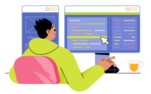

<h1>Hi! I'm Lain. FrontEnd Developer💻</h1>

- I love play videogames.👾,
- Literature 📚,
- Programming 💻,
- Puzzles 🤔,
- Create solutions to problems. 🐱‍🏍

I am FrontEnd Developer specialized in technologies such as JavaScript, TypeScript, ReactJS, Svelte.

I love learning and putting into practice everything I learn, as well as helping others in whatever they need. My goal is find a job in a company as a Jr. FrontEnd Developer. Become a part of a great team and grow creating and developing applications, solutions and webs.

<strong>My pronouns: He/Him.</strong>

- ⚡ <strong>Fun fact</strong>: My first programming language was Python. 🐍
- 📖 <strong>Actually Studying</strong>: MERN Stack. ⚛️

<h2 align="center">Skills</h2>

  
  
My Stack of technologies:

  

<h2 align="center">GitHub Stats</h2>

  

  

